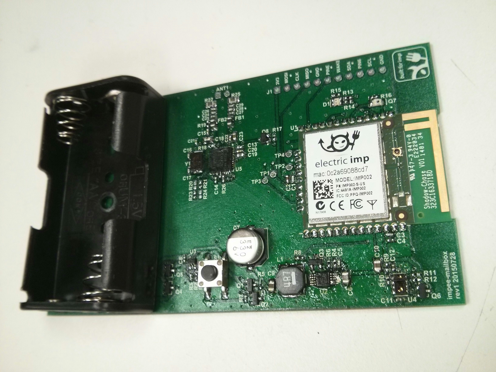

# Electric Imp Mailbox Sensor

The Electric Imp mailbox sensor is a prototype smart mailbox module designed to be placed in existing mailboxes.  This device can sense when mail deliveries occur, identify NFC-tagged mail, and trigger push notifications.

The goal of this project was to follow the process of quickly prototyping an internet-connected device for production using the Electric Imp platform.  This was also an opportunity to test two new pieces of hardware at Electric Imp: the PN532 NFC module and the TMD2772 Proximity/Ambient light sensor.

## Hardware

The mailbox sensor has the following features:

- **Powered by 2xAA batteries** with voltage sense for low-battery notifications
- **Ambient light and proximity sensing** using a [TMD2772](https://ams.com/jpn/content/download/685865/1786649/file/TMD2772WA_Datasheet-%5B1-20%5D.pdf) sensor.  This sensor is used to determine if the mailbox is open and if it contains mail.  It was chosen for having programmable interrupts and containing an IR LED in its package that reduced power usage and lowered the final part count.
- **NFC read/write** using the [PN532](http://www.nxp.com/products/identification_and_security/nfc_and_reader_ics/nfc_controller_solutions/PN5321A3HN.html) NFC controller and an external antenna.  The external antenna was an experimental feature and was designed to allow the device to work in different mailbox configurations (e.g. vertical or horizontal).
- **Processing and wifi** using an [imp002](https://electricimp.com/docs/attachments/hardware/product%20briefs/Electric%20Imp%20-%20imp002%20-%20Product%20Brief%20-%2022Jun2015.pdf) solder-down module
- **I²C, SPI, UART, and interrupt breakouts** for offline debugging and further hacking

The device schematic, Altium project files, generated Gerber files, and BOM can be found in the project [hardware files](./hardware/).

## Software

The software running the device makes extensive use of Electric Imp [software libraries](https://electricimp.com/docs/examples/libraries/) to simplify the codebase.  These classes include pre-tested device drivers and abstractions surrounding common tasks and make it easy to begin designing application logic even before prototype hardware has been manufactured.

### Device-Side

This project used the device driver libraries for the [TMD2772](https://electricimp.com/docs/libraries/hardware/tmd2772.1.0.0/) and [PN532](https://electricimp.com/docs/libraries/hardware/pn532.1.0.0/) modules, as well as a library for advanced [wifi connection management](https://github.com/electricimp/ConnectionManager) that allows the device to conserve power by aggresively staying offline.

The complete device code can be found in the project [software files](./software/mailbox.device.nut).

### Agent-Side

The agent uses the [Rocky](https://electricimp.com/docs/libraries/utilities/rocky.1.2.0/) library to create a REST API for registering expected mail and the [IFTTT](https://github.com/electricimp/IFTTT) library to trigger push notifications when mail arrives.

The complete agent code can be found in the project [software files](./software/mailbox.agent.nut).

## Usage
The device is designed to be small enough to placed in the back of a mailbox.  To extend battery life, it spends most of its time in a low-power sleep mode.  When the mailbox door opens, the resulting light wakes the device.  It checks for the presence of mail using the proximity sensor and if it is found, begins an NFC scan to check for NFC-tagged mail.  Finally, once the scan is complete, it pushes the result to a phone running the [IFTTT app](https://ifttt.com/products#if).

When mail is sent to a mailbox owner, a [cheap NFC tag](http://nfctags.tagstand.com/collections/nfc-stickers/products/the-25-25-25-roll-of-2500-ntag213-stickers) can be added to the mail and then registered with the recipient using a REST API. When tagged mail is received, the device checks if it has been registered and if so, can notify both the sender and receiver of the event.

## License
This project is licensed under the [MIT License](./LICENSE).
